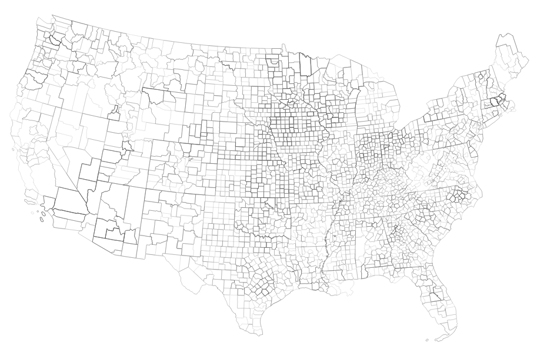

# Utility Landscape
A repository for creating and maintaining a geospatial representation of U.S. electrical utilities' service territories

-------------

## usage

### dependencies
- [postgresql](http://www.postgresql.org/) 9.whatevs
- [psql command line utils](http://www.postgresql.org/docs/9.3/static/app-psql.html)
- [ogr2ogr](http://www.gdal.org/ogr2ogr.html)
- [csvkit](https://github.com/onyxfish/csvkit) (omigod i love this thing)

### run it

`sh maketerritories.sh`

. . . and you're off to the races. 

## About
This module is a component of the Faraday data model, valuable to us because it lets our clients operate within the territories of existing utility partners. __Note that this data does not imply that every location within these territories is served by a given utility.__ The [EIA]() provides this inforomation at the county level, and many utilities only cover sub-areas of an indicated county.

This module may require source URL updating as EIA and the Census shift around their data.

Get the state-by-state geojson [here](geojson_territories/).

## To-do:
- [dat](http://dat-data.com/) integration
- Incorporating state-curated territory data at a greater administrative precision (e.g. [city/neighborhood level](http://www.mass.gov/anf/research-and-tech/it-serv-and-support/application-serv/office-of-geographic-information-massgis/datalayers/pubutil.html))
- Handle multi-state service territories